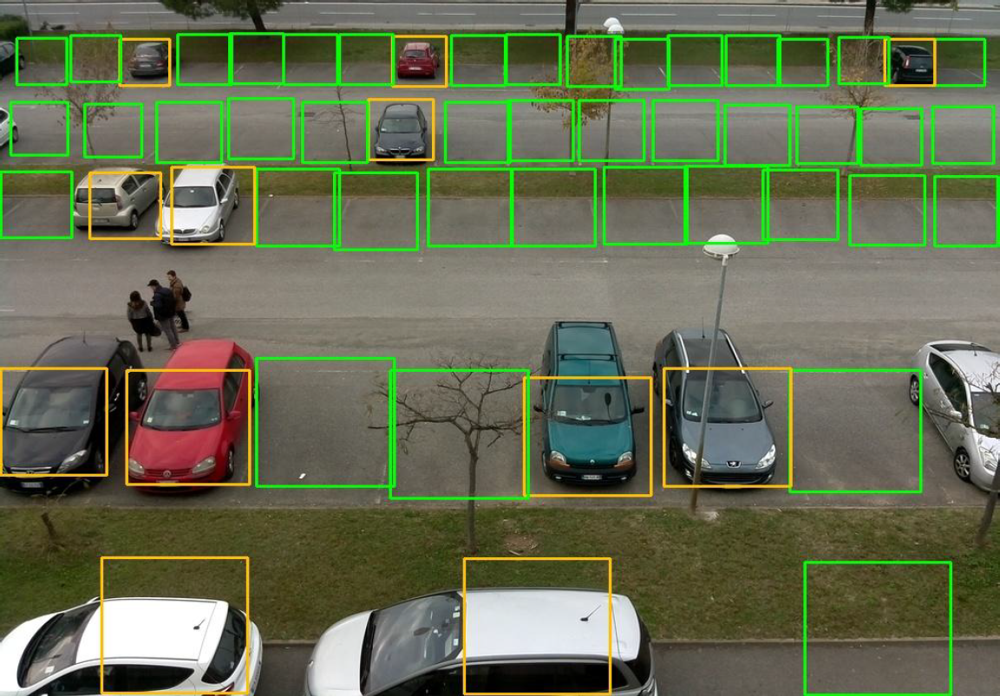
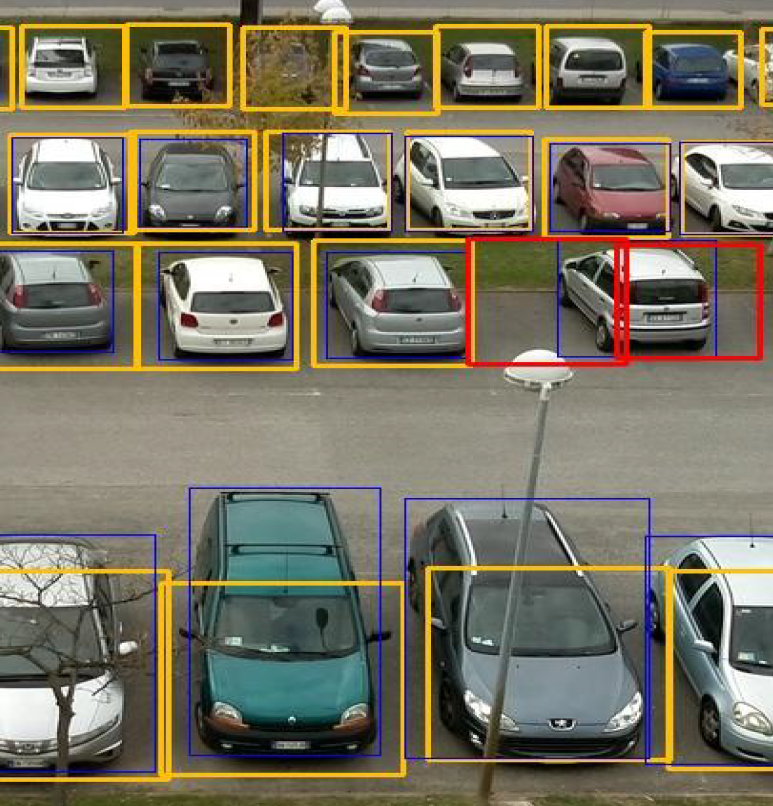
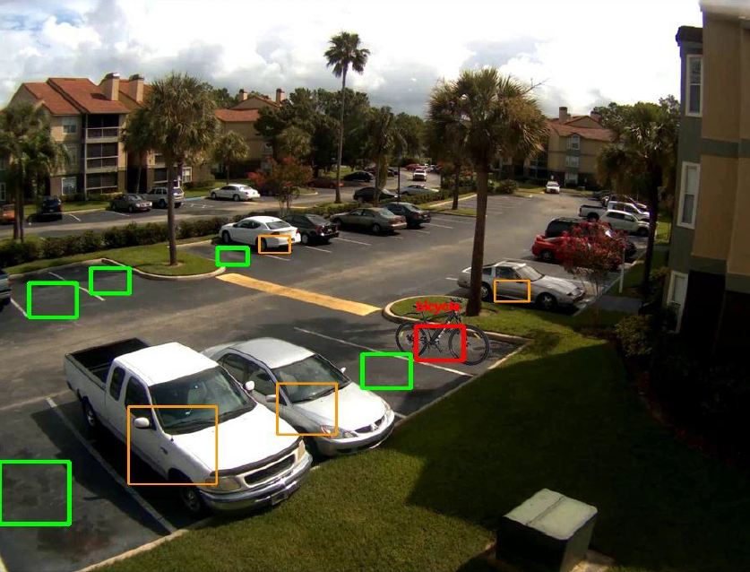
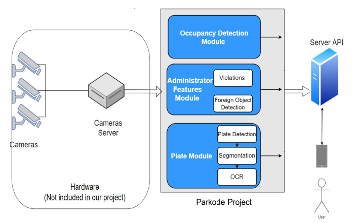

# Parkode
Parkode is a smart parking lot monitoring system that processes live video frames from
surveillance cameras to provide real-time information on occupied/vacant spots, spot overlap violations, foreign objects detection and automatic number plate recognition.

## Occupancy detection
---

## Space overlap detection
---

## Foreign object detection
---

## System Architecture
---
